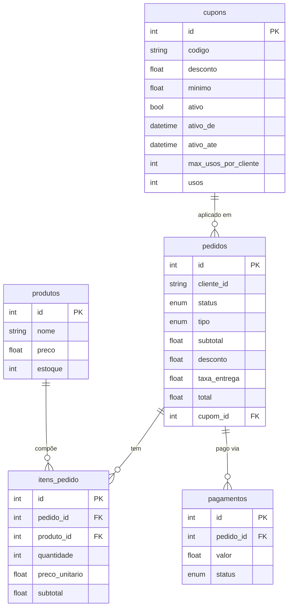

# ☕ Sistema de Pedidos de Cafeteria

Projeto desenvolvido para a disciplina de **Verificação e Validação de Software**, com foco em regras de negócio e testes automatizados.

## Conceito

O sistema simula uma aplicação interna de cafeteria utilizada por um atendente. Além do cadastro de produtos e cupons, permite montar pedidos, controlar estoque, calcular descontos e taxas, registrar pagamentos e controlar os estados do pedido.

## Tecnologias

- **Backend:** FastAPI
- **Frontend:** Jinja2, HTMX e CSS
- **Banco de dados:** SQLite
- **ORM:** SQLAlchemy 2.0
- **Testes:** Pytest, pytest-cov e mutmut

## Arquitetura

```text
app/
├── models.py       # Entidades, relacionamentos e estados
├── database.py     # Configuração do banco
├── routes/         # API e interface web
└── services/       # Regras de negócio

tests/              # Testes 
templates/         
static/            
```

As rotas recebem as requisições e delegam as decisões para os serviços. Essa separação permite testar as regras diretamente e também de forma integrada por meio da API.

## Diagrama do banco de dados



## Funcionalidades e regras de negócio

- Controle de produtos e estoque.
- Adição e remoção de itens com recálculo do subtotal.
- Restauração do estoque ao remover itens ou cancelar pedidos.
- Cupons com estado, vigência, subtotal mínimo e limite por cliente.
- Identificação obrigatória do cliente para cupons limitados.
- Retirada e consumo local sem taxa.
- Entrega por R$ 10,00, gratuita a partir de R$ 50,00 após o desconto.
- Pagamento confirmado ou falho.
- Uso do cupom incrementado somente após pagamento confirmado.
- Bloqueio de alterações em pedidos pagos ou cancelados.
- Pedido vazio não pode ser finalizado.

Estados utilizados:

- **Pedido:** `criado`, `pago`, `cancelado`
- **Pagamento:** `pendente`, `confirmado`, `falhou`
- **Tipo:** `retirada`, `consumo_local`, `entrega`

## Testes

### Particionamento de equivalência de cupons

| Condição | Classe válida | Classes inválidas |
|---|---|---|
| Código | Informado e existente | Vazio ou inexistente |
| Estado | Ativo | Inativo |
| Vigência | Dentro do período | Futuro ou expirado |
| Subtotal | Igual ou acima do mínimo | Abaixo do mínimo |
| Cliente | Identificado quando necessário | Ausente em cupom limitado |
| Limite | Abaixo do máximo | Limite atingido |

A classe válida foi representada por um caso que satisfaz todas as condições. Cada causa de invalidez foi isolada em um teste separado.

### Análise de valores limite

| Regra | Abaixo | No limite | Acima |
|---|---|---|---|
| Cupom com mínimo de R$ 50 | R$ 49,99: rejeita | R$ 50,00: aceita | R$ 50,01: aceita |
| Entrega grátis a partir de R$ 50 | R$ 49,99: taxa R$ 10 | R$ 50,00: grátis | R$ 50,01: grátis |
| Expiração às 15h | 14:59: válido | 15:00: válido | 15:01: expirado |
| Estoque `N` | quantidade 0: rejeita | quantidade `N`: aceita | quantidade `N+1`: rejeita |

## Organização dos testes

A suíte possui 102 testes:

| Arquivo | Escopo |
|---|---|
| `test_bva_particionamento.py` | BVA e classes de equivalência |
| `test_cupons.py` | Validade e limite dos cupons |
| `test_pedidos.py` | Estoque, entrega, estados e finalização |
| `test_pagamentos.py` | Sucesso e falha com stub |
| `test_regras_negocio.py` | Regras combinadas |
| `test_rotas.py` | Integração da API com `TestClient` |
| `test_models.py` e `test_database.py` | Modelos e persistência |
| `test_e2e_fluxo_pedido.py` |  Teste E2E com Playwright do fluxo completo do pedido |

Distribuição:

- 72 testes unitários/regras isoladas;
- 29 testes de integração;
- 1 teste E2E de fluxo completo.

No GitHub Actions, rodam automaticamente 101 testes a cada push. O teste E2E fica desativado por padrão e é executado localmente com `RUN_E2E=1`, pois depende de navegador.

Os testes utilizam SQLite em memória e um banco limpo para cada caso. Nas rotas, o `TestClient` utiliza esse banco por meio da substituição da dependência `get_db`.

## Integração contínua (Github Actions)

1. instalação das dependências;
2. testes e cobertura;
3. teste de mutação nos serviços;
4. cálculo do score de mutação.

### Cobertura (pytest)

Cobertura total: **93%**

### Teste de mutação (mutmut)

O mutmut foi executado sobre `app/services`, onde estão as principais regras.

Mutantes mortos: 264 / (264 + 45 + 5) = **84,08%**

## Limitações

- O pagamento é simulado, sem provedor externo.
- O CPF é utilizado como identificador, sem validação completa dos dígitos.

## Como acessar

Acesse: <https://cafeteria-order-system.onrender.com/painel>

Documentação da API: <https://cafeteria-order-system.onrender.com/docs>
