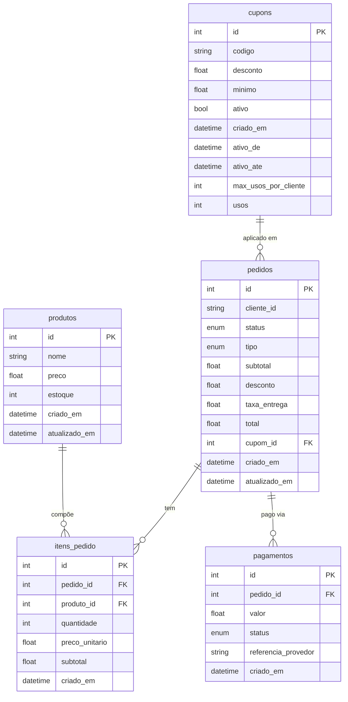

# ☕ Sistema de Pedidos de Cafeteria

Projeto prático desenvolvido para a disciplina de **Verificação e Validação de Software**, focado na aplicação de boas práticas de teste e desenvolvimento.

## Conceito

O sistema simula uma aplicação interna de pedidos para cafeteria, usada por um atendente no balcão. A aplicação permite cadastrar produtos e cupons, montar pedidos, aplicar descontos, calcular taxas, registrar pagamentos e controlar o status dos pedidos.

## Stack

- **Backend:** FastAPI
- **Frontend:** Jinja2, HTMX e CSS
- **Banco de dados:** SQLite
- **ORM:** SQLAlchemy 2.0
- **Testes:** Pytest, pytest-cov

## Diagrama do banco de dados

## Funcionalidades

- Cadastro e listagem de produtos.
- Controle de estoque.
- Cadastro e listagem de cupons.
- Validação de cupons por:
  - status ativo/inativo;
  - data de início;
  - data de expiração;
  - subtotal mínimo;
  - limite de uso por cliente.
- Criação de pedidos.
- Adição e remoção de itens do pedido.
- Bloqueio de produtos sem estoque durante a montagem do pedido.
- Cálculo de subtotal.
- Definição do tipo de pedido:
  - retirada;
  - entrega;
  - consumo local.
- Cálculo de taxa de entrega.
- Aplicação de cupom.
- Finalização de pedido.
- Registro de pagamento.
- Remoção de cupom aplicado.
- Cancelamento de pedido.
- Consulta dos detalhes, pagamento e histórico do pedido.

## Regras de Negócio

Algumas das principais regras implementadas:

- Um pedido não pode ser finalizado sem itens.
- Um produto não pode ser adicionado ao pedido se não houver estoque suficiente.
- Ao cancelar um pedido, o estoque reservado pelos itens é restaurado.
- Cupons inativos ou expirados não podem ser usados.
- Cupons podem exigir subtotal mínimo.
- Cupons com limite de uso por cliente exigem a identificação do cliente por CPF; para os demais cupons, o CPF é opcional.
- Um cliente não pode ultrapassar o limite de uso definido para um cupom.
- Pedidos pagos ou cancelados não podem receber alterações.
- Pagamento falho não consome cupom nem incrementa o número de usos.
- O uso do cupom é incrementado somente quando o pedido é finalizado com sucesso.
- A taxa de entrega varia por tipo de pedido: consumo local e retirada são gratuitos; entrega tem taxa de R$10,00, mas se o subtotal após desconto for de pelo menos R$50,00, a entrega também fica gratuita.
